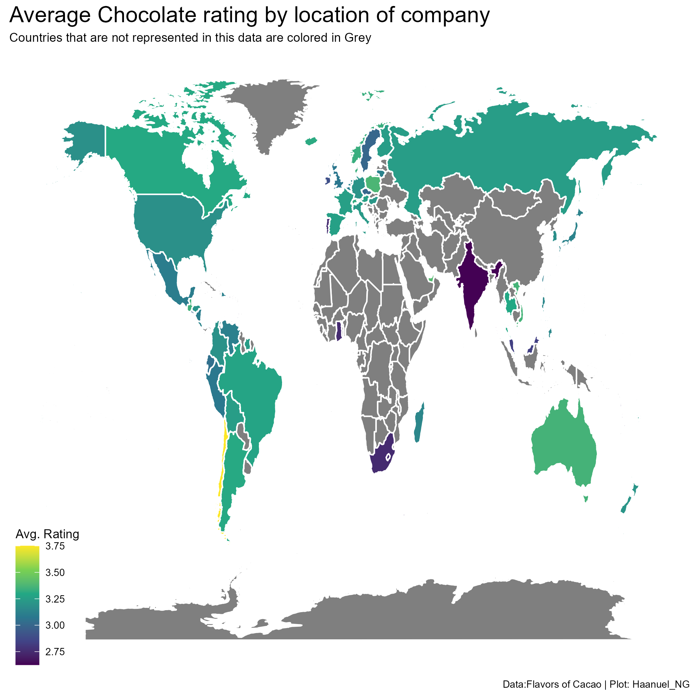

# Summary

In this week \#tidytuesday data, we explore data on chocolate rating across different companies all over the world. We try to build a machine learning model to predict whether a particular rating is above 3/5 or not.

{width="900" height="550"}
