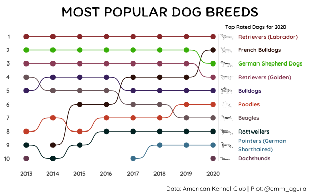

# Summary

In this week \#tidytuesday data, I created a data viz project that shows trend of the top rated dogs in 2020. I got inspiration from [Nicola Rennie](https://twitter.com/nrennie35/status/1488499506236772352 "Twitter Post"). I learnt some new tricks in data viz like using the `ggbump` package and including images in my plots.

