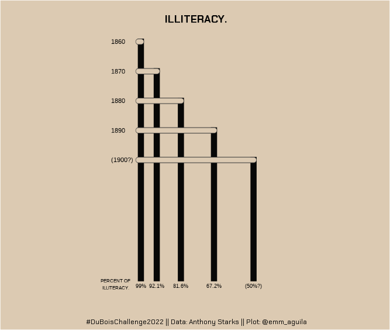

# Summary

In this week's \#tidytuesday, I participated in the \#duboischallenge2022. The goal of the challenge is to celebrate the data visualization legacy of W.E.B Du Bois by recreating the visualizations from the 1900 Paris Exposition using modern tools (R).

I recreated challenge 6. The plot shows the level of illiteracy.

**Original**

**Recreated**

  
