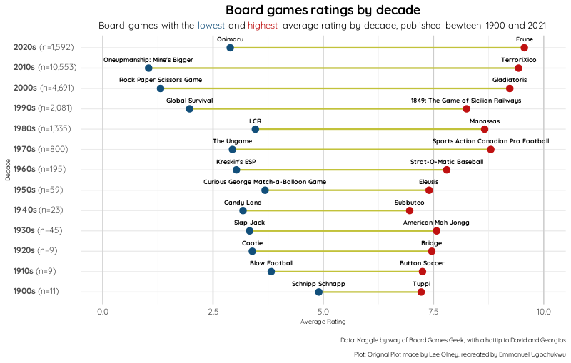
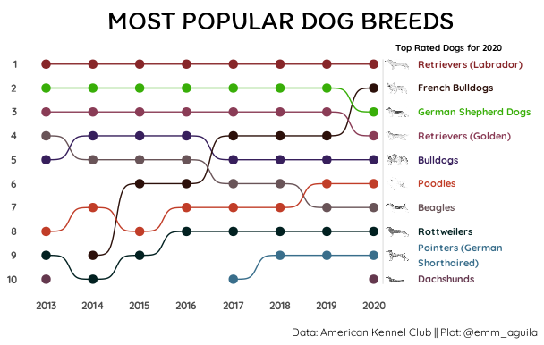
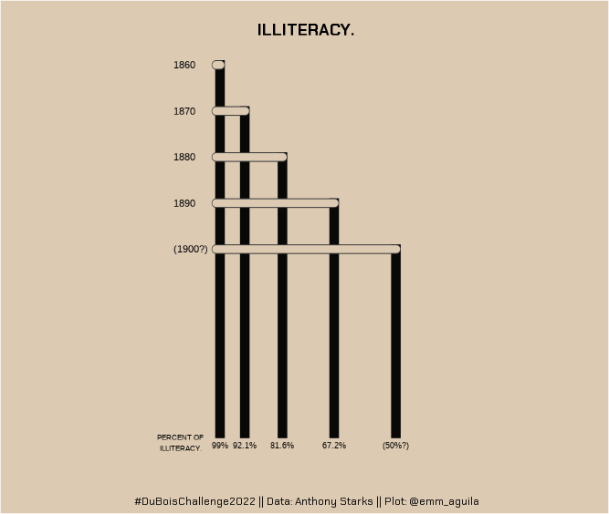

# \#TidyTuesday

Hello and welcome to my \#tidytuesday repo where I save my contributions and analysis on weekly \#tidytuesday dataset.

## Highlights

Code: [View code](https://github.com/EmmanuelUgo/tidytuesday/tree/main/2022/2022-01-25)

Code: [View Code](https://github.com/EmmanuelUgo/tidytuesday/tree/main/2022/2022-02-01)

Code: [VIew Code](https://github.com/EmmanuelUgo/tidytuesday/tree/main/2022/2022-02-15)

